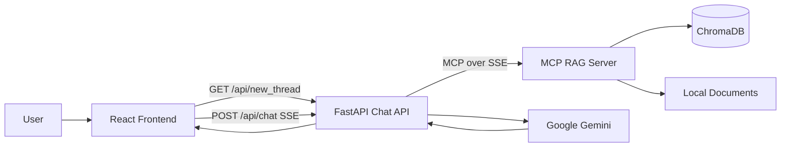
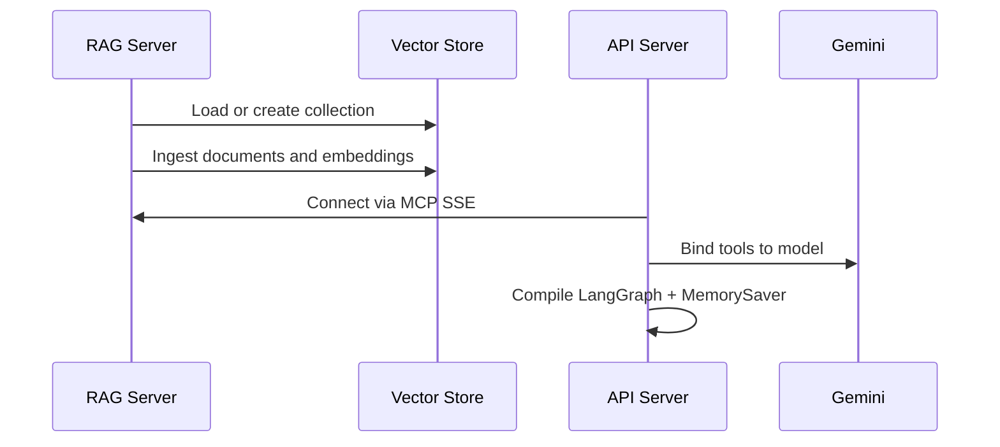
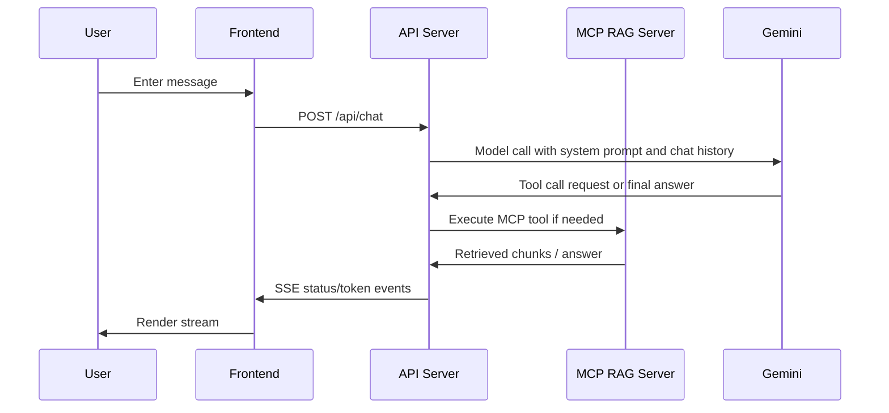

# System Design

## 1. Overview

This project is a local Retrieval-Augmented Generation (RAG) chatbot with three distinct runtime layers:

- A document retrieval service that ingests local files, builds embeddings, and exposes retrieval as MCP tools.
- A chat orchestration API that uses LangGraph and Google Gemini to decide when to call retrieval tools and how to format responses.
- A React frontend that creates conversations, sends user messages, and streams assistant responses in real time.

The design separates retrieval from orchestration so each layer has one main responsibility. The RAG service owns document ingestion and similarity search. The FastAPI service owns conversation state and LLM/tool coordination. The frontend owns user interaction and streaming display.

## 2. Goals

The system is designed to:

- Answer questions using only the local knowledge base.
- Keep the retrieval index persistent across restarts.
- Stream responses to the browser instead of waiting for a full completion.
- Preserve conversation state by thread id.
- Keep the backend services loosely coupled so the frontend API can evolve without rewriting the retrieval layer.

## 3. Technology Stack

### Backend
- Python 3.9+
- FastAPI for HTTP and SSE endpoints
- MCP FastMCP for tool exposure
- LangChain and LangGraph for model orchestration
- Google Generative AI via `ChatGoogleGenerativeAI`
- SentenceTransformers for embedding generation
- ChromaDB for persistent vector storage
- `langchain-mcp-adapters` for consuming MCP tools from the API server

### Frontend
- React
- Vite
- Native browser `fetch` and streaming response handling

### Storage
- Local files in `data_files/`
- Persistent Chroma collection in `vector_database/`

## 4. High-Level Architecture



### Responsibilities by layer

#### React Frontend
- Creates a new conversation id on page load.
- Sends user messages to the FastAPI backend.
- Parses server-sent events and updates the UI incrementally.
- Renders the conversation list, typing indicator, and assistant messages.

#### FastAPI Chat API
- Initializes the LangGraph agent once at startup.
- Connects to the MCP RAG server using `MultiServerMCPClient`.
- Binds available MCP tools to the Gemini model.
- Maintains conversation thread state through `MemorySaver`.
- Streams intermediate and final responses back to the frontend.

#### MCP RAG Server
- Loads and normalizes files from `data_files/`.
- Splits text into chunks.
- Generates embeddings.
- Stores chunks and metadata in ChromaDB.
- Exposes retrieval as tools, especially `answer_question`.

## 5. Runtime Topology

The application expects two Python processes and one frontend process during development:

- `pipelines/rag_server.py` on port `8000` with SSE transport
- `pipelines/api_server.py` on port `8001`
- `frontend` on Vite dev server port `5173`

Vite proxies `/api` requests to the FastAPI server so the browser does not need to know the backend port directly.

## 6. Component Design

### 6.1 Document Corpus

The corpus lives in `data_files/` and currently supports:

- `.pdf`
- `.txt`
- `.docx`

Each file is loaded into `Document` objects and enriched with metadata such as:

- source path
- file name
- file type
- page number for PDFs

Metadata values are sanitized to remain compatible with ChromaDB storage.

### 6.2 Ingestion Pipeline

The ingestion path is implemented in the RAG server lifecycle.

Steps:

1. Load documents from `data_files/`.
2. Split documents into chunks using `RecursiveCharacterTextSplitter`.
3. Embed chunk text with `SentenceTransformer`.
4. Persist the embeddings and metadata in ChromaDB.
5. Keep the collection on disk under `vector_database/`.

The server uses startup-time ingestion so the vector index is ready before any tool calls are made.

### 6.3 Vector Storage

Chroma is used as a persistent vector store because it is simple to run locally and persists across application restarts.

Important characteristics:

- Persistent client points at `vector_database/`.
- A single collection stores document chunks.
- Each chunk gets a generated id and metadata.
- The retrieval layer uses similarity search to rank candidate chunks.

### 6.4 Retrieval Tools

The RAG server exposes MCP tools. The most important one is `answer_question`.

`answer_question` does the following:

- Retrieves relevant chunks for the query.
- Sends the query and context to Gemini.
- Returns the answer plus retrieved document details.

This tool is the contract consumed by the LangGraph agent. The system prompt instructs the model to use the tool for factual questions.

### 6.5 LangGraph Chat Orchestrator

The FastAPI service compiles a LangGraph workflow with two nodes:

- `agent`
- `tools`

The `agent` node calls Gemini with the system prompt and current conversation history. The model is bound to the MCP tools discovered from the RAG server.

The `tools` node executes tool calls emitted by the model.

The graph loops as follows:

- User message enters the `agent` node.
- If the model chooses a tool, the workflow transitions to `tools`.
- The tool result is sent back to `agent`.
- When the model produces a final answer without tool calls, the backend streams it to the frontend.

Conversation state is preserved using `MemorySaver` with a `thread_id` supplied by the client.

### 6.6 Frontend Chat Experience

The frontend is intentionally thin.

It handles:

- Initial conversation creation via `/api/new_thread`
- Sending messages via `/api/chat`
- Parsing SSE chunks manually with `ReadableStream`
- Displaying assistant status updates like `Searching knowledge base...`
- Rendering assistant answers as they arrive

The UI stores messages per conversation in local React state. It does not persist conversations to disk, so refreshing the page resets the browser-side session list.

## 7. API Design

### 7.1 `GET /api/new_thread`

Returns a fresh UUID used to isolate one conversation from another.

Example response:

```json
{ "thread_id": "550e8400-e29b-41d4-a716-446655440000" }
```

### 7.2 `POST /api/chat`

Request body:

```json
{
  "message": "What does the knowledge base say about retrieval?",
  "thread_id": "550e8400-e29b-41d4-a716-446655440000"
}
```

Response type:

- `text/event-stream`

Event contract:

- `status` indicates that the agent is searching or using a tool.
- `token` contains the final assistant answer text.
- `done` signals that the stream is complete.
- `error` contains a failure message.

Example stream:

```text
data: {"type":"status","text":"Searching knowledge base..."}

data: {"type":"token","text":"Here is the answer..."}

data: {"type":"done"}
```

## 8. Data Flow

### 8.1 Startup Flow



### 8.2 User Query Flow



### 8.3 Tool-Use Flow

1. The system prompt forces factual questions through `answer_question`.
2. Gemini emits a tool call.
3. LangGraph routes the call to the `tools` node.
4. The MCP client executes the tool on the RAG server.
5. Tool results return to the `agent` node.
6. The model produces a grounded answer.

## 9. Conversation State Model

The backend uses a simple in-memory thread model.

- Each chat session has a unique `thread_id`.
- The frontend requests a thread id once per conversation.
- The FastAPI backend uses that id as the LangGraph configurable thread key.
- `MemorySaver` stores the message history for the duration of the process.

Implications:

- Conversations survive between messages while the server stays up.
- Conversations are lost if the API server restarts.
- This is acceptable for a demo, but not for a production multi-user deployment.

## 10. Prompting and Answer Policy

The system prompt is intentionally strict.

Rules enforced by the prompt:

- Use `answer_question` for factual content.
- Do not answer from training knowledge for factual questions.
- If retrieval returns nothing useful, say that clearly.
- Allow casual conversation only for non-factual interactions.

This keeps the assistant grounded in the local knowledge base and reduces hallucination risk.

## 11. Error Handling

### Frontend
- If `/api/new_thread` fails, conversation creation fails early.
- If the SSE stream errors, the UI renders a connection error message.
- The send button is disabled while streaming to prevent overlapping requests.

### FastAPI API Server
- Missing `GOOGLE_API_KEY` fails startup immediately.
- SSE generation wraps the request in a `try/except` block and streams an error event if execution fails.
- CORS is restricted to the Vite dev server origin.

### RAG Server
- Ingestion errors fail startup so the system does not run with an empty or broken vector index.
- Unsupported files are skipped and logged.
- Metadata sanitization prevents Chroma serialization issues.

## 12. Persistence and Storage

### Persistent
- Chroma collection data in `vector_database/`
- Source documents in `data_files/`

### Volatile
- Conversation history in `MemorySaver`
- Browser conversation list and message state in React state
- MCP client instance in process memory

## 13. Operational Constraints

The current design assumes:

- A single local developer machine.
- One active backend process for the retrieval service.
- One active backend process for the chat API.
- One browser tab or a small number of tabs.

This keeps the implementation simple, but it also means:

- There is no shared session store.
- There is no authentication.
- There is no multi-user authorization boundary.
- There is no distributed caching or queueing.

## 14. Security Considerations

The current implementation is suitable for local development, but not hardened for production.

Important points:

- API keys live in environment variables, not in source control.
- CORS is narrowed to the local frontend origin.
- The assistant is constrained to local documents for factual responses.
- There is no user authentication or tenant isolation.

If this were deployed publicly, the design would need authentication, rate limiting, request validation hardening, and stricter observability.

## 15. Performance Characteristics

The design uses a few choices to keep latency manageable:

- Precompute and persist embeddings.
- Reuse the vector database across restarts.
- Keep the MCP client alive for the server lifetime.
- Stream responses instead of buffering a full answer.
- Use a small embedding model and a fast Gemini model for the chat path.

Potential bottlenecks:

- Initial document ingestion can be slow if the corpus grows.
- Gemini latency dominates end-to-end response time for hard questions.
- MemorySaver does not scale across processes.

## 16. Failure Modes

Common failure cases include:

- Missing Google API key.
- RAG server not running before the API server starts.
- Empty or unsupported `data_files/` content.
- Broken Chroma store from incompatible embedding changes.
- Frontend unable to reach the API server.

Observed behavior should be explicit:

- Startup should fail fast when the knowledge base or model key is missing.
- Streaming errors should surface in the UI instead of silently failing.

## 17. Deployment Notes

For local development, start the services in this order:

1. RAG server
2. API server
3. Frontend dev server

For a more complete deployment, the same logical split can be kept, but the ports and transports would likely change:

- RAG server could run behind a container or internal service.
- API server could be exposed through a reverse proxy.
- Frontend could be built into static assets.

The current implementation is still optimized for a developer workstation rather than a production cluster.

## 18. Extensibility

This architecture is easy to extend in a few directions:

- Add more file loaders to the ingestion pipeline.
- Swap Chroma for another vector store with minimal API changes.
- Add persistent chat history storage.
- Add user authentication and access control.
- Add citations in the frontend response renderer.
- Add reranking or hybrid retrieval for improved relevance.
- Add background reindexing when `data_files/` changes.

## 19. Why the Split Design Works

The separation between `rag_server.py` and `api_server.py` is deliberate.

- The retrieval server stays focused on data and search.
- The API server stays focused on conversational control flow.
- The frontend stays focused on presentation.

That split keeps the code easier to reason about and makes it easier to replace one piece without breaking the others.

## 20. Summary

This system is a three-tier local RAG application:

- Documents are ingested and embedded in a persistent vector store.
- A LangGraph API uses Gemini plus MCP tools to answer grounded questions.
- A React frontend streams the response to the user in real time.

The current design is intentionally simple, but it already provides a solid base for a production-grade RAG application if persistence, authentication, and scale requirements are added later.
